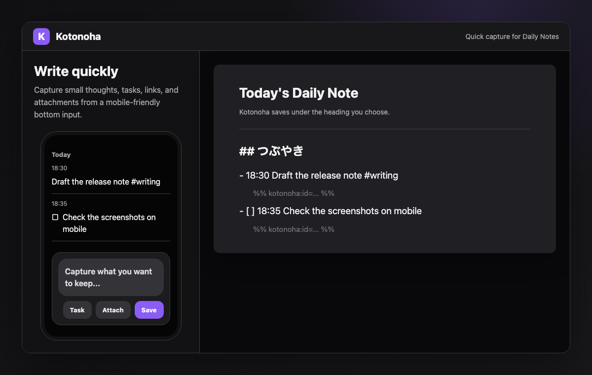
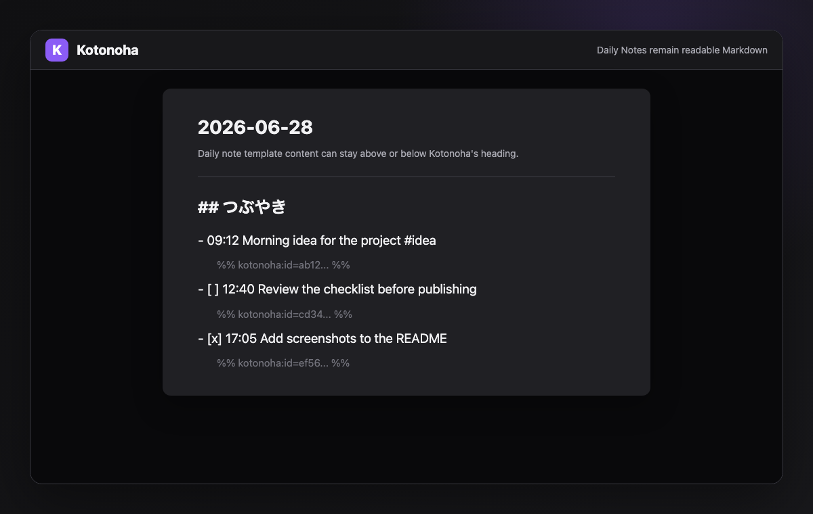
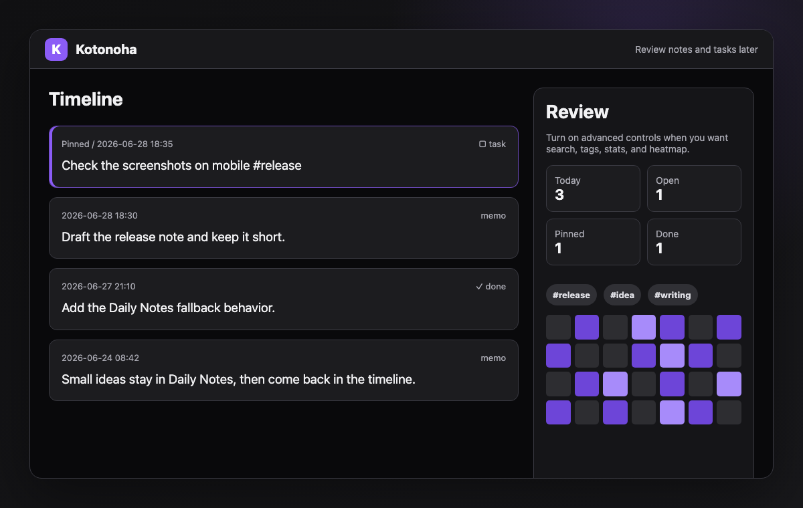

# Kotonoha

Kotonoha is a lightweight quick-capture plugin for Obsidian. It saves everyday notes and tasks to Daily Notes, then lets you review them in a simple timeline.

The name comes from the Japanese word `言の葉` (`kotonoha`), an older expression for words or language.

## What it looks like

1. Write from the bottom input.
2. Save to today's Daily Note.
3. Review notes and tasks in the timeline.







## Demo videos

English:

https://github.com/user-attachments/assets/3f104dc7-39fe-4072-bf11-3575524b2a62


## Features

- Append notes to Daily Notes
- Create today's Daily Note when it does not exist
- Save tasks and toggle completion
- Add file attachments as vault links
- Review notes in a timeline
- Optional search, filters, tags, stats, heatmap, and reflection tools
- Japanese and English UI, with automatic language detection

## Install

After Kotonoha is listed in Community Plugins, search for `Kotonoha` in Obsidian settings and install it.

- [Kotonoha in the Obsidian plugin directory](https://obsidian.md/plugins?id=kotonoha)
- [Open Kotonoha in Obsidian](obsidian://show-plugin?id=kotonoha)

To install manually, download these files from the latest release and place them in `.obsidian/plugins/kotonoha/` in your vault:

- `main.js`
- `manifest.json`
- `styles.css`

Reload Obsidian, then enable Kotonoha from Community Plugins.

## Usage

1. Open Kotonoha.
2. Write a note in the bottom input.
3. Press `Save` or `残す`.

Turn on `Task` before saving to create an open task. You can also start the text with `[ ]` or `[x]`.

## Daily Notes

By default, Kotonoha appends notes to today's Daily Note. If today's Daily Note does not exist, Kotonoha creates it using your Daily Notes settings and template before saving.

You can change the destination heading in settings. The default heading is `つぶやき`.

```markdown
## つぶやき
- 18:30 Finished today's notes #work
  %% kotonoha:id=... %%
- [ ] 18:35 Review tomorrow's document
  %% kotonoha:id=... %%
```

## Recommended setup

- Keep Daily Notes enabled.
- Set the Daily Note heading to the section where you want quick notes to appear.
- Keep advanced controls hidden for quick capture, then turn them on when you want search, filters, tags, stats, heatmap, or reflection tools.
- Leave the display language on `Auto` unless you want to force Japanese or English.

## 日本語

Kotonohaは、短いメモやタスクをDaily Notesへすばやく保存し、あとからタイムラインで見返すための軽量なquick captureプラグインです。

名前は、言葉を意味する古い表現の `言の葉` から取っています。

### 使い方

1. Kotonohaを開く
2. 下部の入力欄にメモを書く
3. `残す` を押す

`タスク` をオンにして保存すると、未完了タスクとして保存されます。本文を `[ ]` または `[x]` から始める方法も使えます。

初期設定では、今日のDaily Noteにメモを追記します。今日のDaily Noteがまだない場合は、ObsidianのDaily Notes設定とテンプレートを使って作成してから保存します。

Japanese:


[Open Japanese MP4](assets/kotonoha-demo-ja.mp4)

## Development

See [CONTRIBUTING.md](CONTRIBUTING.md) for development, testing, and release steps.

## License

MIT License. See [LICENSE](LICENSE).
